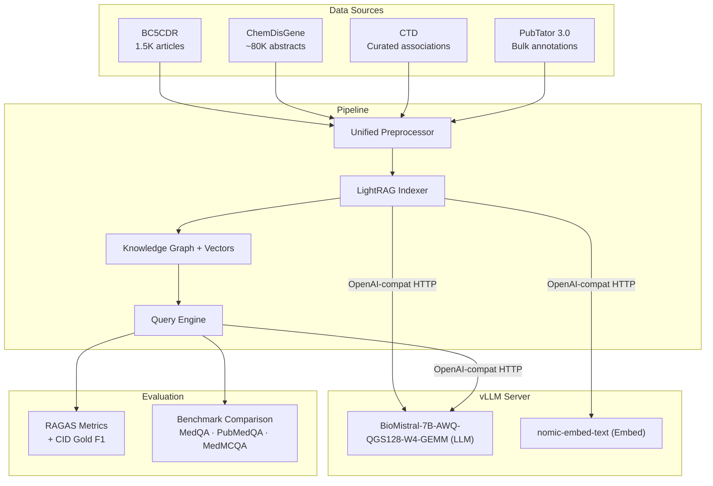
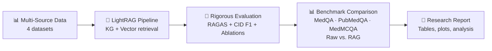

# Biomedical RAG QA with LightRAG + BioMistral-7B-AWQ (via vLLM)

## Background

The goal is to build and **evaluate** a multi-source RAG QA system for biomedical chemical-disease queries using **LightRAG** + **[BioMistral/BioMistral-7B-AWQ-QGS128-W4-GEMM](https://huggingface.co/BioMistral/BioMistral-7B-AWQ-QGS128-W4-GEMM)** served via **vLLM** (OpenAI-compatible API).

> [!NOTE]
> This model uses **AWQ (W4-GEMM)** quantization. AWQ is natively supported by **vLLM** — not llama.cpp (which uses GGUF). vLLM also exposes an OpenAI-compatible HTTP API, so the rest of the stack is unchanged.

---

## Architecture Overview



---

## Data Sources (Phased)

| Phase | Dataset | Size | Format | Purpose |
|-------|---------|------|--------|---------| 
| 1 | **BC5CDR** | 1,500 articles | PubTator | Core — gold-standard CID relations |
| 2 | **ChemDisGene** | ~80K abstracts | PubTator | Scale — same format, easy integration |
| 3 | **BioASQ** | Thousands | JSON/TXT | Factoid/list/summary — multi-document retrieval |
| 4 | **MedQA** | ~61K questions | JSONL | Multiple choice — clinical reasoning |
| 5 | **PubMedQA** | ~273K pairs | JSON | Yes/no/maybe — scientific claim verification |

### Key Differences Between the Biomedical QA Datasets
| Feature | MedQA | PubMedQA | BioASQ |
|---------|-------|----------|--------|
| **Question source** | medical exams | paper titles | expert-written |
| **Documents** | none provided | one abstract | multiple papers |
| **Answer type** | multiple choice | yes/no/maybe | factoid/list/summary |
| **Focus** | clinical reasoning | research claims | biomedical information retrieval |

### Why researchers combine these datasets
Modern biomedical QA systems often use:
- **MedQA** → clinical reasoning
- **PubMedQA** → scientific claim verification
- **BioASQ** → multi-document retrieval

This combination tests different medical knowledge skills.

---

## Project Structure

```
biomed-rag/
├── module/                   # Main project source code
│   ├── RAG_pipeline/         # Core RAG components (chunking, embeddings, generation, ingestion, pipeline, retrieval, vectorstore)
│   └── data_processing/      # Dataset parsing scripts (bc5cdr.py, ctd.py, pubtator.py)
├── notebooks/                # Jupyter notebook demonstrations
│   ├── processing_demo/
│   └── rag_demo/
├── experiments/              # Model experiments and ablation studies
├── finetune/                 # Fine-tuning scripts
├── shared_functions/         # Shared utilities (Google Drive/Sheets integration)
├── tests/                    # Unit tests
├── secrets/                  # Credentials directory
├── data/                     # Dataset storage
│   ├── external/             # Hub datasets downloaded via script
│   │   ├── bc5cdr/           # BioCreative V CDR Corpus
│   │   ├── ChemDisGene/      # ChemDisGene dataset
│   │   ├── bioasq/           # BioASQ benchmark dataset
│   │   ├── medqa/            # MedQA multiple-choice dataset
│   │   └── pubmedqa/         # PubMedQA text reasoning dataset
│   └── vectorstore/          # Vector datastore
├── plan.md   
├── todo.txt               
├── set_up_dataset.py         # Dataset preparation script
├── requirements.txt          # Python dependencies
└── .env.example              # Environment variables template
```

---

## Proposed Implementation

### Phase 1-3: Setup, Preprocessing, Indexing

*(Install vLLM, load AWQ model, parse multi-source data, build LightRAG index)*

```bash
# 1. Install vLLM (supports AWQ natively)
pip install vllm lightrag-hku ragas openai

# 2. Start vLLM server — LLM (port 8080)
python -m vllm.entrypoints.openai.api_server \
    --model BioMistral/BioMistral-7B-AWQ-QGS128-W4-GEMM \
    --quantization awq \
    --host 0.0.0.0 --port 8080 \
    --max-model-len 4096

# 3. Start embedding server — nomic-embed-text (port 8081)
python -m vllm.entrypoints.openai.api_server \
    --model nomic-ai/nomic-embed-text-v1.5 \
    --task embedding \
    --host 0.0.0.0 --port 8081
```

#### `config.py` — LightRAG pointing to vLLM

```python
from lightrag.llm.openai import openai_complete_if_cache, openai_embed

LLM_MODEL      = "BioMistral/BioMistral-7B-AWQ-QGS128-W4-GEMM"
EMBED_MODEL    = "nomic-ai/nomic-embed-text-v1.5"
LLM_BASE_URL   = "http://localhost:8080/v1"
EMBED_BASE_URL = "http://localhost:8081/v1"

async def llm_fn(prompt, **kwargs):
    return await openai_complete_if_cache(
        LLM_MODEL, prompt,
        base_url=LLM_BASE_URL, api_key="none", **kwargs
    )

async def embed_fn(texts):
    return await openai_embed(
        texts, model=EMBED_MODEL,
        base_url=EMBED_BASE_URL, api_key="none"
    )
```

---

### Phase 4: Evaluation Framework ⭐

#### [NEW] [evaluate.py]

**A. RAG Quality Metrics (RAGAS)**

| Metric | What it Measures | Why it Matters |
|--------|-----------------|----------------|
| **Faithfulness** | Are claims supported by retrieved context? | Detects hallucination |
| **Answer Relevance** | Does the answer address the question? | Detects off-topic responses |
| **Context Precision** | Are relevant docs ranked higher? | Measures retrieval quality |
| **Context Recall** | Were all needed docs retrieved? | Measures retrieval coverage |

**B. Task-Specific Evaluation (CID Relation Extraction)**

Using BC5CDR gold-standard CID relations:

1. For each gold relation `(Chemical, Disease)` → query: *"Does {chemical} induce {disease}?"*
2. Parse LLM answer → `yes/no`
3. Compute **Precision / Recall / F1** against gold labels
4. Report per-source accuracy

**C. Ablation Studies**

| Experiment | What to Compare |
|------------|----------------|
| Retrieval modes | `local` vs `global` vs `hybrid` — which gives best F1? |
| Data source impact | BC5CDR only → +ChemDisGene → +CTD — marginal gains per source |
| With/without KG | LightRAG (KG+vector) vs naive RAG (vector only) |

---

### Phase 5: Benchmark Comparison ⭐

> **Yes — you should compare your RAG system against the raw model on published benchmarks.** This is the clearest way to demonstrate that retrieval augmentation genuinely improves the model beyond its pretrained knowledge.

#### Strategy: RAG vs. Raw Model on Medical QA Benchmarks

For each benchmark, run two conditions:

| Condition | Description |
|-----------|-------------|
| **Raw model** | BioMistral-7B-AWQ answers directly (no retrieval), 3-shot |
| **RAG system** | Same model, but answers are grounded via LightRAG retrieval |

#### Published Baseline Scores (from [BioMistral paper](https://arxiv.org/abs/2402.10373))

These are the **raw model** scores you are competing against — pulled from the official HuggingFace model card / paper (3-shot, English):

| Benchmark | Task | BioMistral-7B (raw) | Your RAG Target |
|-----------|------|---------------------|-----------------|
| **MedQA** (USMLE 4-opt) | MC QA | 50.6% | > 50.6% |
| **MedQA-5opts** (USMLE 5-opt) | MC QA | 42.8% | > 42.8% |
| **PubMedQA** | Yes/No/Maybe QA | 77.5% | > 77.5% |
| **BioASQ** | Factoid/List/Summary QA | 54.5% | > 54.5% |

> [!IMPORTANT]
> The AWQ quantized variant (`W4-GEMM`) may show marginally different scores vs. the fp16 base due to quantization. **Re-run raw-model baselines yourself** on the same hardware before reporting comparisons — do not cite paper numbers directly as your raw baseline.

#### [NEW] [benchmark.py]

```python
# Load a benchmark (e.g. MedQA) from HuggingFace datasets
from datasets import load_dataset

BENCHMARKS = {
    "medqa_4opts":  ("bigbio/med_qa",        "med_qa_en_source"),
    "medqa_5opts":  ("bigbio/med_qa",        "med_qa_en_5options_source"),
    "pubmedqa":     ("bigbio/pubmed_qa",     "pubmed_qa_l_source"),
    "bioasq":       ("bigbio/bioasq_task_b", None),
}

def run_benchmark(name, rag_enabled=False):
    """Run a benchmark in raw-model or RAG-augmented mode."""
    dataset = load_dataset(*BENCHMARKS[name], split="test")
    results = []
    for item in dataset:
        question = format_question(item)
        if rag_enabled:
            context = rag.query(question, mode="hybrid")
            prompt  = f"Context:\n{context}\n\nQuestion:\n{question}"
        else:
            prompt  = question          # 3-shot, no retrieval
        answer = llm_answer(prompt)
        results.append(evaluate_answer(answer, item["answer"]))
    return accuracy(results)
```

#### Expected Output — Comparison Table

```
| Benchmark     | Raw BioMistral-7B-AWQ | + LightRAG RAG | Δ Gain |
|---------------|-----------------------|----------------|--------|
| MedQA 4-opts  |  xx.x%                |  xx.x%         | +x.x%  |
| MedQA 5-opts  |  xx.x%                |  xx.x%         | +x.x%  |
| PubMedQA      |  xx.x%                |  xx.x%         | +x.x%  |
| BioASQ        |  xx.x%                |  xx.x%         | +x.x%  |
```

---

### Phase 6: Query Interface

Interactive CLI with multiple modes (`local`, `global`, `hybrid`).

### Phase 7: Reporting

Generate final comparison report with tables + plots:
- RAGAS scores across configurations
- CID P/R/F1
- Benchmark comparison: raw model vs. RAG-augmented
- KG statistics (entities, relations extracted)

---

## Summary: What Makes This a Strong Project



| Component | Just Deploy | ✅ This Plan |
|-----------|-------------|-------------|
| Data | 1 source | 4 sources (phased) |
| Model | Use as-is | AWQ-quantized BioMistral |
| Evaluation | None | RAGAS + CID F1 + ablations |
| Benchmark | None | Raw vs. RAG on 4 medical QA benchmarks |
| Output | Q&A demo | Demo + metrics + research report |

---

## Verification Plan

### Automated
1. Verify vLLM server: `curl http://localhost:8080/v1/models`
2. Verify embed server: `curl http://localhost:8081/v1/models`
3. Smoke-test LLM: `curl http://localhost:8080/v1/chat/completions -d '{"model":"BioMistral/BioMistral-7B-AWQ-QGS128-W4-GEMM","messages":[{"role":"user","content":"What is hypertension?"}]}'`
4. Preprocessing: check output file counts per source
5. Indexing: verify KG entity/relation counts
6. RAGAS: all metrics compute without errors
7. CID eval: P/R/F1 output against gold labels
8. `benchmark.py`: raw vs. RAG accuracy outputs for all 4 benchmarks

### Manual
1. End-to-end `demo.ipynb` walkthrough
2. Inspect KG for correct biomedical entities
3. Spot-check answers vs. known CID relations
4. Review ablation and benchmark plots for reasonable trends
